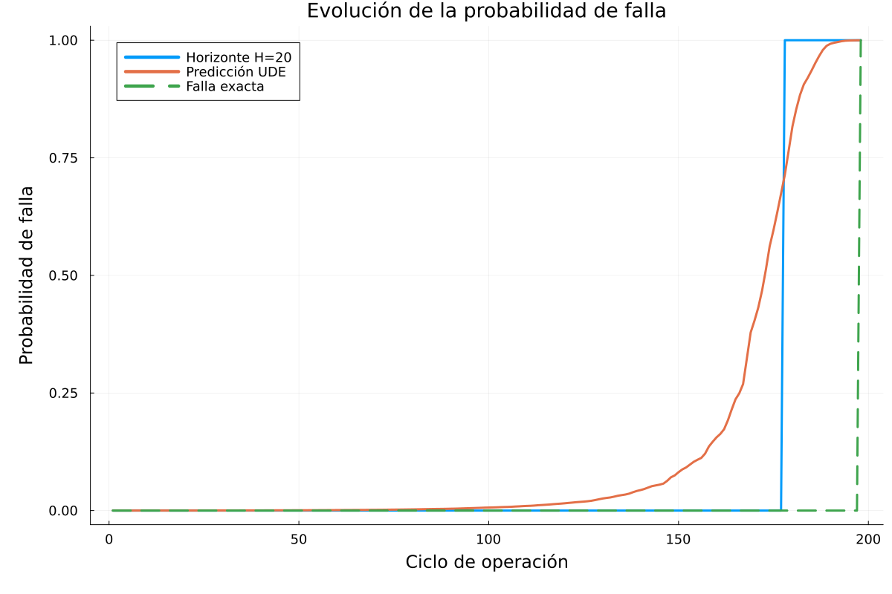
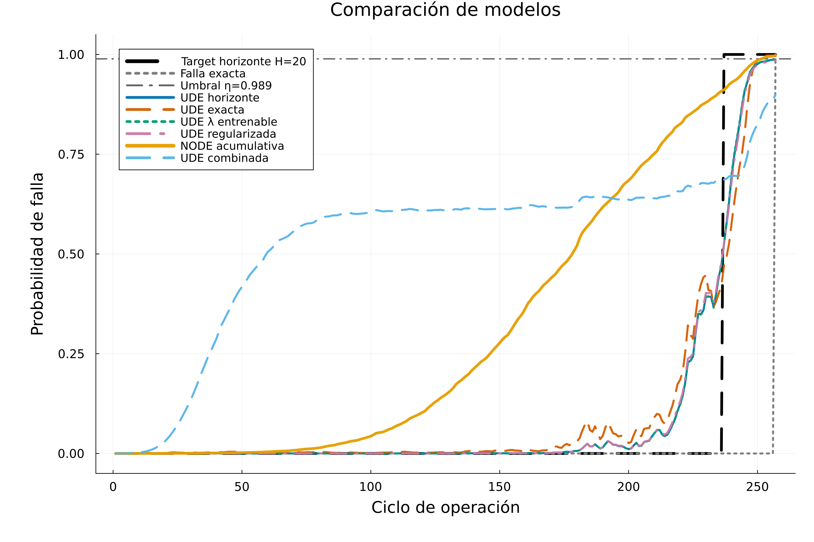

# Modelado dinámico de degradación de motores turbofan mediante NODEs y UDEs

Proyecto desarrollado para la materia **Datos, Ecuaciones Diferenciales e Inteligencia Artificial** de la Facultad de Ciencias Exactas y Naturales de la Universidad de Buenos Aires.

## Descripción

Este proyecto estudia la detección temprana de fallas en motores turbofan utilizando el conjunto de datos **C-MAPSS**, desarrollado por la NASA.

El problema se formula desde una perspectiva de **análisis de supervivencia en tiempo discreto**. A partir de las mediciones temporales de distintos sensores, se busca estimar una trayectoria de probabilidad de falla para cada motor y determinar el ciclo en el que debería emitirse una alerta.

Se implementaron y compararon los siguientes modelos:

- Neural Ordinary Differential Equations (**NODEs**)
- Universal Differential Equations (**UDEs**)
- Regresión logística como modelo de referencia

## Conjunto de datos

C-MAPSS contiene trayectorias simuladas de motores turbofan sometidos a procesos de degradación progresiva.

Cada fila representa un ciclo de operación e incluye:

- Un identificador del motor
- El número de ciclo de operación
- Tres variables asociadas a las condiciones operativas
- Mediciones de 21 sensores

Para los experimentos se utilizaron trayectorias completas hasta la falla provenientes del conjunto `train_FD001`.

La separación entre entrenamiento y prueba se realizó por motor completo. De esta manera, los ciclos pertenecientes a un mismo motor no pueden aparecer simultáneamente en ambos conjuntos, evitando una posible fuga de información.

## Formulación de supervivencia

Para una trayectoria cuya falla ocurre en el ciclo $T$, se define $h_t$ como la probabilidad de que el motor falle en el ciclo $t$, condicionada a que haya sobrevivido hasta el ciclo anterior.

La probabilidad de observar una falla exactamente en el ciclo $T$ es:

$$
P(T) = \left(\prod_{t=1}^{T-1}(1-h_t)\right)h_T.
$$

Esta expresión indica que el motor debe sobrevivir durante todos los ciclos anteriores a $T$ y fallar en el ciclo final.

La función de pérdida correspondiente es la log-verosimilitud negativa:

$$
\mathcal{L} = -\sum_{t=1}^{T-1}\log(1-h_t) - \log(h_T).
$$

Debido al fuerte desbalance entre los numerosos ciclos de supervivencia y el único ciclo de falla, se evaluaron dos definiciones de la variable objetivo:

- **Etiqueta exacta:** únicamente el último ciclo de cada trayectoria recibe una etiqueta positiva
- **Horizonte de falla:** los últimos $H=20$ ciclos se consideran parte de la región de riesgo

Para la variante con etiqueta exacta también se utilizó una pérdida ponderada. El peso asociado al evento de falla se seleccionó mediante una división interna del conjunto de entrenamiento, sin utilizar el conjunto de prueba final.

## Modelos evaluados

### UDE general

La dinámica de la UDE general se define como:

$$
\frac{dz}{dt} = -\alpha z + NN(z,\tau,S(t)).
$$

En esta expresión:

- $z$ es el estado latente asociado a la degradación
- $\alpha$ es el parámetro de relajación
- $\tau$ representa el tiempo normalizado
- $S(t)$ contiene las mediciones interpoladas de los sensores
- $NN$ es una red neuronal que aprende la parte no modelada de la dinámica

El término $-\alpha z$ introduce una estructura de relajación o memoria, mientras que la red neuronal aproxima los componentes de la dinámica que no fueron especificados explícitamente.

Se evaluaron las siguientes variantes:

- UDE entrenada con etiqueta de horizonte
- UDE entrenada con etiqueta exacta
- UDE con parámetro de relajación entrenable
- UDE con regularización de la trayectoria predicha

### NODE acumulativa

La NODE acumulativa se define mediante:

$$
\frac{dz}{dt} = \mathrm{softplus}(NN(\tau,S(t))).
$$

La función `softplus` garantiza que la derivada sea no negativa. En consecuencia, el estado latente de degradación sólo puede aumentar, generando trayectorias monótonas y consistentes con la interpretación de una degradación acumulativa.

### UDE combinada

La UDE combinada utiliza la siguiente dinámica:

$$
\frac{dz}{dt} = -\alpha z + \mathrm{softplus}(NN(\tau,S(t))).
$$

Esta variante combina un término de relajación con una tasa de degradación neuronal no negativa. De esta forma, el modelo conserva una estructura dinámica explícita, pero permite que la red neuronal aprenda una contribución acumulativa dependiente de los sensores.

## Selección y preparación de sensores

De los 21 sensores originales se seleccionaron cinco variables mediante los siguientes criterios:

- Eliminación de sensores con varianza nula o cercana a cero
- Evaluación de la correlación con el *Remaining Useful Life*
- Eliminación de sensores altamente redundantes entre sí

Las mediciones discretas se interpolaron para construir funciones continuas $S(t)$. Esta transformación es necesaria porque el solucionador de la ecuación diferencial puede evaluar la dinámica en tiempos intermedios entre los ciclos observados.

El tiempo se normalizó utilizando exclusivamente información disponible en el conjunto de entrenamiento.

## Entrenamiento

Los modelos NODE y UDE se implementaron en Julia utilizando `Lux.jl` y `OrdinaryDiffEq.jl`.

Durante el entrenamiento se utilizaron:

- El optimizador Adam
- Mini-batches de trayectorias completas
- Diferenciación automática mediante Zygote
- Conservación de los mejores parámetros según la función de pérdida
- Detención temprana cuando no se observaban mejoras relevantes

## Evaluación

A partir de la trayectoria estimada $h_t$, el ciclo predicho de detección se define como:

$$
\widehat{T} = \min \{ t : h_t \geq \eta \}.
$$

Se utilizó un mismo umbral para todos los modelos:

$$
\eta = 0.989.
$$

El error temporal se define como:

$$
\Delta T = \widehat{T} - T.
$$

Su interpretación es la siguiente:

- $\Delta T < 0$: la falla fue detectada anticipadamente
- $\Delta T = 0$: la falla fue detectada en el ciclo exacto
- $\Delta T > 0$: la detección ocurrió después del ciclo de falla
- Si la trayectoria no supera el umbral, la falla se considera no detectada

Para comparar los modelos se reportaron las siguientes métricas:

- Tasa de detección
- Error temporal medio
- Raíz del error cuadrático medio (RMSE)
- Proporción de detecciones tempranas
- Proporción de detecciones exactas

## Resultados

| Modelo | Detección | Error medio | RMSE | Tempranas | Exactas |
|:--|--:|--:|--:|--:|--:|
| UDE horizonte | 66.7% | -3.38 | 4.40 | 75.0% | 25.0% |
| UDE exacta | 83.3% | -6.50 | 8.34 | 100.0% | 0.0% |
| UDE con parámetro entrenable | 66.7% | -3.63 | 4.49 | 87.5% | 12.5% |
| UDE horizonte regularizada | 41.7% | -3.80 | 4.54 | 100.0% | 0.0% |
| NODE acumulativa | 75.0% | -9.11 | 13.81 | 77.8% | 22.2% |
| UDE combinada | 66.7% | -4.38 | 5.47 | 87.5% | 12.5% |
| Regresión logística | 16.7% | -2.50 | 2.55 | 100.0% | 0.0% |

La UDE entrenada con etiqueta exacta obtuvo la mayor tasa de detección entre las variantes UDE, aunque también presentó una anticipación temporal más pronunciada.

La UDE entrenada con horizonte de falla alcanzó errores temporales más moderados entre las trayectorias detectadas. Por su parte, la NODE acumulativa produjo curvas más suaves e interpretables, aunque obtuvo un RMSE mayor.

La regresión logística detectó una proporción considerablemente menor de motores. Este resultado sugiere que incorporar explícitamente la dinámica temporal aporta información relevante para la detección de fallas.

El error medio y el RMSE se calcularon únicamente sobre las trayectorias en las que el modelo produjo una detección. Por este motivo, estas métricas deben analizarse conjuntamente con la tasa de detección.

## Ejemplos de trayectorias

### Evolución de la probabilidad de falla



La probabilidad estimada aumenta progresivamente a medida que el motor se aproxima al ciclo real de falla. La etiqueta de horizonte señala la región temporal considerada de riesgo durante el entrenamiento.

### Comparación entre modelos



Las variantes UDE presentan incrementos concentrados cerca de la falla. La NODE acumulativa genera una trayectoria monótona, mientras que la UDE combinada puede mantener probabilidades intermedias durante una parte más extensa de la trayectoria.

## Conclusiones

Los resultados muestran que los modelos NODE y UDE permiten construir trayectorias continuas de riesgo a partir de mediciones temporales de sensores.

Las principales observaciones obtenidas fueron:

- El enfoque de supervivencia permite estimar probabilidades de falla directamente a partir de los datos observados.
- Los modelos dinámicos capturan la evolución temporal de la degradación.
- La etiqueta exacta favorece una mayor tasa de detección, pero puede incrementar la anticipación.
- El horizonte de falla reduce el efecto del desbalance y produce errores temporales más moderados.
- La restricción acumulativa mejora la interpretabilidad de las trayectorias, aunque puede reducir la flexibilidad predictiva.
- La comparación con la regresión logística respalda el uso de modelos que incorporan explícitamente la evolución temporal.

Los resultados deben interpretarse como una evaluación experimental realizada sobre datos simulados. Como posibles extensiones futuras se propone estudiar arquitecturas más profundas, términos físicos más elaborados, modelos tabulares no lineales y datos reales de operación.

## Tecnologías utilizadas

- Julia
- CSV.jl
- DataFrames.jl
- Statistics
- Plots.jl
- Lux.jl
- ComponentArrays.jl
- OrdinaryDiffEq.jl
- SciMLSensitivity.jl
- Optimization.jl
- OptimizationOptimisers.jl
- Zygote.jl
- DataInterpolations.jl
- MLUtils.jl
- LinearAlgebra


El notebook principal del proyecto se encuentra en:

```text
mi_entorno/degradacionPrueba.ipynb
```

Los documentos asociados al proyecto son:

```text
Motores_Informe.pdf
Poster_Motores.pdf
```


## Autores

- Gian Lucca Sanza
- Sebastián Souto

## Licencia

Este proyecto se distribuye bajo la licencia MIT.
